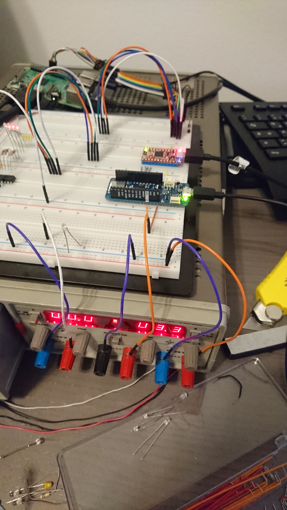
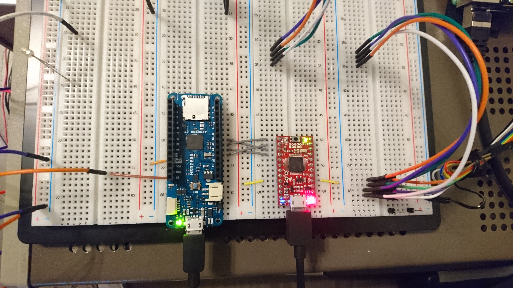
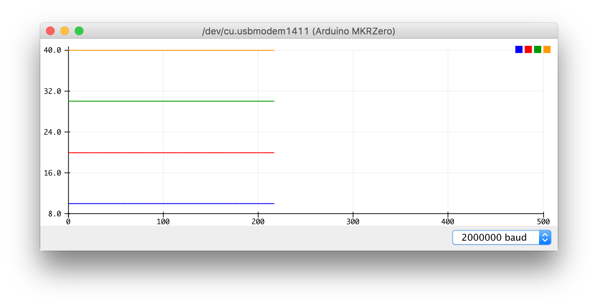
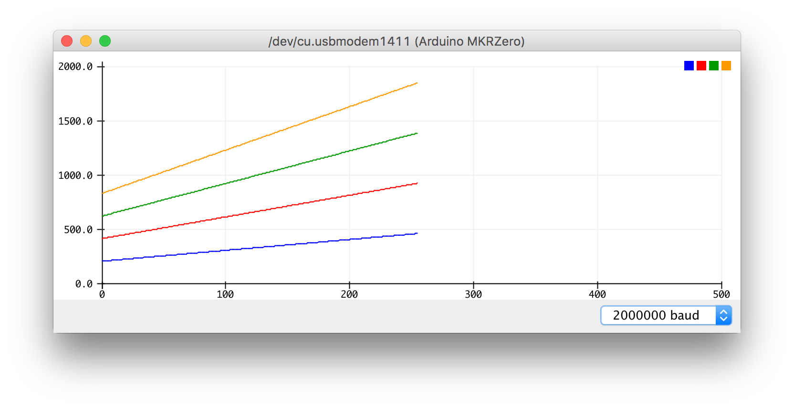
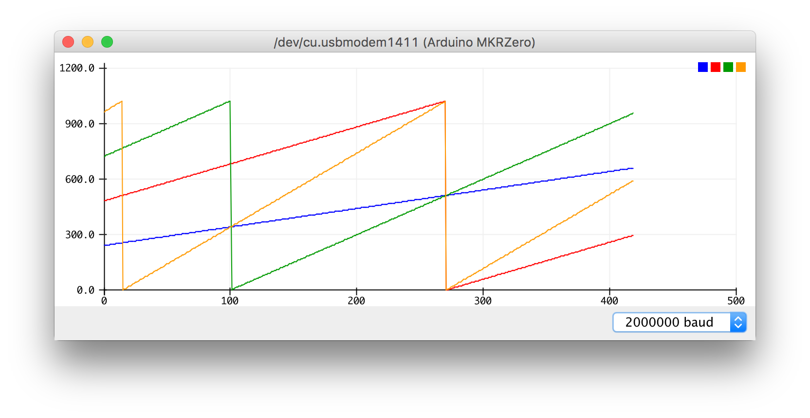
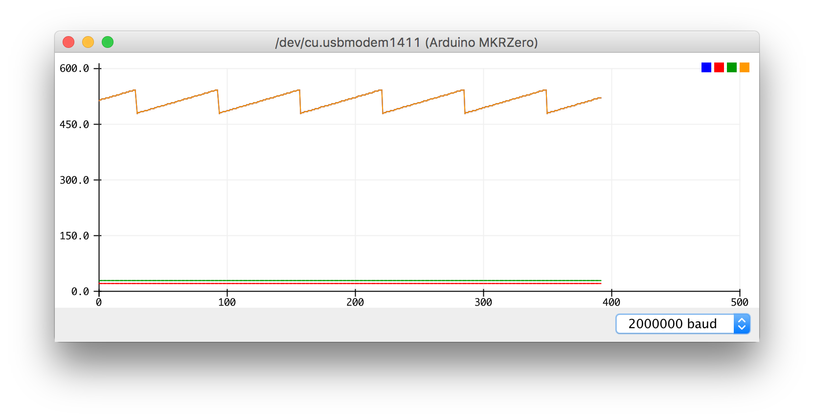
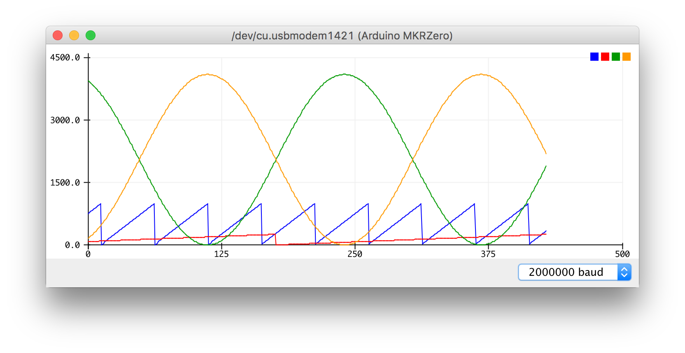

Series of arduino examples that emerged during my spare time project 

# SPI

Within this section i am trying to figure out how to communicate over [SPI](https://en.wikipedia.org/wiki/Serial_Peripheral_Interface_Bus) using two different boards:
An [Arduino MKRZero](https://store.arduino.cc/arduino-mkrzero) and
  a [SparkFun SAMD21 Mini Breakout](https://github.com/sparkfun/SAMD21_Mini_Breakout).
I will reference these boards for simplicity, `mkrzero` and `samd21mini` respectively.
Regard this section as a collection of template programs for certain communication patterns.
It is also a little comparison between both boards, but mainly focuses on the communication part.
But lets start with a small collection of references for both boards.

## Cheat Sheet

Both are using the same *Atmel [ATSAMD21G18](http://www.microchip.com/wwwproducts/en/ATSAMD21G18) µc*.
This facilitates porting programs between both boards.
However, board layouts and periphereals differ.
Best source for these information are the corresponding github repositories and manufacturer pages.
Thanks to the arduino platform both repositories have a similar structure.
Here are the most important files together with other technical references in comparison:

| `mkrzero` | `samd21mini` |
|-----------|--------------|
| [repo](https://github.com/arduino/ArduinoCore-samd/tree/master)                                        | [repo](https://github.com/sparkfun/Arduino_Boards/tree/master/sparkfun/samd) |
| [variants dir](https://github.com/arduino/ArduinoCore-samd/tree/master/variants/mkrzero)               | [variants dir](https://github.com/sparkfun/Arduino_Boards/tree/master/sparkfun/samd/variants/SparkFun_SAMD_Mini) |
| [variant.h](https://github.com/arduino/ArduinoCore-samd/blob/master/variants/mkrzero/variant.h)        | [variant.h](https://github.com/sparkfun/Arduino_Boards/blob/master/sparkfun/samd/variants/SparkFun_SAMD_Mini/variant.h) |
| [variant.cpp](https://github.com/arduino/ArduinoCore-samd/blob/master/variants/mkrzero/variant.cpp)    | [variant.cpp](https://github.com/sparkfun/Arduino_Boards/blob/master/sparkfun/samd/variants/SparkFun_SAMD_Mini/variant.cpp) |
| [manufacturer](https://store.arduino.cc/arduino-mkrzero)                                               | [manufacturer](https://github.com/sparkfun/SAMD21_Mini_Breakout) |
| [getting started](https://www.arduino.cc/en/Guide/ArduinoMKRZero)                                      | [getting started](https://learn.sparkfun.com/tutorials/samd21-minidev-breakout-hookup-guide/resources--going-further) |
| [schematic](https://www.arduino.cc/en/uploads/Main/ArduinoMKRZero-schematic.pdf)                       | [schematic](https://cdn.sparkfun.com/assets/learn_tutorials/4/5/4/sparkfun-atsamd21g-breakout-schematic.pdf) |
| [pcb backside](http://files.linuxgizmos.com/arduino_mkrzero_back.jpg) (nothing comparable)             | [graphical datasheet](https://cdn.sparkfun.com/assets/learn_tutorials/4/5/4/graphicalDatasheet-Mini.pdf) |

## Program's Origin

Programs that appear in slave configuration are based on one particular source.
User *Tom_the_banana* posted it [on the Arduino forum](https://forum.arduino.cc/index.php?topic=360026.0).
Thanks to this i was able to jump start with a simple slave configuration right away.
I appreciate his code very much :)
However i found some adaptions useful in general and others necessary to my underlying use case.

## Communication Patterns

These terms will make it easier to identify certain communication patterns.
At least during debugging when things are simplified for trouble shooting.

### Unidirectional Slave Send and Master Recieve

The code of *Tom_the_banana* can be classified as what i call a **slave reciever**.
That is, because it is a slave that is mainly designed to recieve data from its master.
Therefore, i turned the program into a **slave sender**.
Furthermore, there is a second program to form the **slave sender**'s counter part what i call a **master reciever**.
Note that these terms only apply to unidirectional communication patterns.
Well, or at least to those which have a clear focus to it.

### Bidirectional Loopback (TODO)

Within bidirectional communication patterns there is this notion of a **loopback** program.
Data that arrives is just send back to its sender.
This can be implemented on both; a master and a slave device.
That is useful for debugging certain problems as well and is going to be included later on.

### Forwarder (TODO)

TODO

## Wiring and Muxing
| wiring + supply | wiring only | master slave |
|-----------------|-------------|--------------|
|  |  |  |

Both boards are connected to a power supply. 
The `mkrzero` is fed with +5V over the `5V` pin and the `samd21mini` is fed with +3.3V over the `VCC` pin.
Furthermore, both are connected to ground over their corresponding `GND` pins.
Another connection leads to some pc using micro usb cables for programming and debugging.

Both boards are wired directly with each other over the SPI lines; `MISO`, `MOSI`, `SCK` and `SS`.
The `mkrzero` acts as the slave sender and the `samd21mini` as the master reciever.

| `samd21mini` _master reciever_ |  line     | `mkrzero` _slave sender_ |
|--------------------------------|-----------|--------------------------|
| `13`                           | `SCK`     | `A4`                     |
| `11`                           | `MOSI`    | `A3`                     |
| `12`                           | `MISO`    | `A6`                     |
| `10`                           | `SS`      | `A5`                     |

The hardware configuration on the `samd21mini` is already finished at this point within this use case.
That is, because the pins `10` to `13` correspond to the predefined default SPI instance.
Configuring the `mkrzero` is a little bit trickier.
The hardware configuration of the `mkrzero` within this use case is specified using the macros defined below.
This makes it easier to port this program to another board or different hardware configuration.
```
#define MY_SPI_MOSI    A3
#define MY_SPI_SCK     A4
#define MY_SPI_SS      A5
#define MY_SPI_MISO    A6
#define MY_SERCOM           SERCOM0
#define MY_SERCOM_IRQn      SERCOM0_IRQn
#define MY_SERCOM_HANDLER   SERCOM0_Handler
#define MY_GCM_SERCOM_CORE  GCM_SERCOM0_CORE
```

Since the analog lines `A3` to `A6` are not supposed to work as SERCOM lines by default, these need to be reprogrammed.
This reprogramming process is called muxing, which is a short term for multiplexing.
Usually pins are programmed with the `pinMode` function.
However, to overwrite predefined deafults use the `pinPeripheral` function which resides in `wiring_private.h`.
```
#include "wiring_private.h"
...
void setup() {
  ...
  pinPeripheral(MY_SPI_MISO,  PIO_SERCOM_ALT);
  pinPeripheral(MY_SPI_SCK,   PIO_SERCOM_ALT);
  pinPeripheral(MY_SPI_MOSI,  PIO_SERCOM_ALT);
  pinPeripheral(MY_SPI_SS,    PIO_SERCOM_ALT);
  ...
}
```
*Note:* These configurations must be chosen carefully and aren't arbitrary. 
The default hardware configuration of each board can be looked up within the corresponding `variants.h` and `variants.cpp` files.
For further reference consult the boards' and µc's datasheets.
These are all referenced within the [cheat sheet](#cheat-sheet).

For a closer look on muxing the ATSAMD21 in general, consult the excellent article and companion video presentation of _lady ada_ listed below. 
I recommend watching the video and follow the article along:
- [www.youtube.com](https://www.youtube.com/watch?v=L2edpBP3AWE)
- [learn.adafruit.com](https://learn.adafruit.com/using-atsamd21-sercom-to-add-more-spi-i2c-serial-ports/muxing-it-up)


## Programs

Lets have a look on the data structures which are goint to be shared in the slave sender and master reciever programs:
```
const int NWORDS = 4;
const int NBYTES = NWORDS * 2;

/// TYPE DEFINITIONS
typedef union { uint16_t words[NWORDS]; uint8_t bytes[NBYTES]; } MODEL;
void format(MODEL &model, char *msg) {
  sprintf(
    msg, "%d %d %d %d",
    model.words[0], model.words[1], model.words[2], model.words[3]
  );
}
```
Both programs always use 4 words, each consisting of 2 bytes, during SPI transactions.
The `typedef union {...} MODEL` allows to access either these 4 words or the underlying 8 bytes.
This `MODEL` allows to easily test and compare different transfer styles.


### Slave Send Program

There is an [implementation of this program](./mkrzero-slave-send/mkrzero-slave-send.ino) for the `mkrzero`.
The slave send program provides several options about what kind of data should be send to the master.
Available options are:

| expectation | callback | description |
|-------------|----------|-------------|
|           | `updateConst`      | constant bytes |
|         | `updateCounter`    | simple counters resulting in sawtooth shapes |
|  | `updateCounterMod` | simple counters with smaller mod to better focus on certain bits |
|       | `updateRangeBit9`  | ranged counters around the 9th bit that is good to illustrate a problem described below (not solved yet) |
|         | `updateComplex`    | complex datasets including sine wave shapes and real time counter |

Just use the global variable `doUpdate` to setup the desired callback function:
```
void (*doUpdate)(MODEL&) = updateComplex; // callback function pointer
```

This is going to update the `current` `MODEL` instance, as it is passed into the callback within the `loop` routine:
```
void loop() {
  if(!withinTx) last = current;
  if(preload && !withinTx) MY_SERCOM->SPI.DATA.reg = last.bytes[0];
  if(needsUpdate) {
    doUpdate(current);
    needsUpdate = false;
    format(current, msg);
    Serial.println(msg);
  }
}
```

Then reprogram the µC to produce the corresponding output as stated in the images above.
To reproduce the exact same output as above, use the plot viewer inside the Arduino IDE.

Use the global variable `preload` to switch between using preloading or not.
A value of `true` activates preloading as it is implemented right now.

### Master Recieve Program

There is an [implementation of this program](./SPI/samd21-master-revieve/samd21-master-revieve.ino) for the `samd21mini`.
The master recieve program provides several options.
One option controls how fast data should be gathered from the slave by specifying a `samplingDelay`.
The other option controls an `offset` for the incoming bytes.
This allows to interpret the first incoming byte as the second byte or third byte and s.o..
```
int samplingDelay = 20;
int offset = 1;
```


If everything works as expected the recieved data in the master corresponds exactly to the data being generated in the slave.
