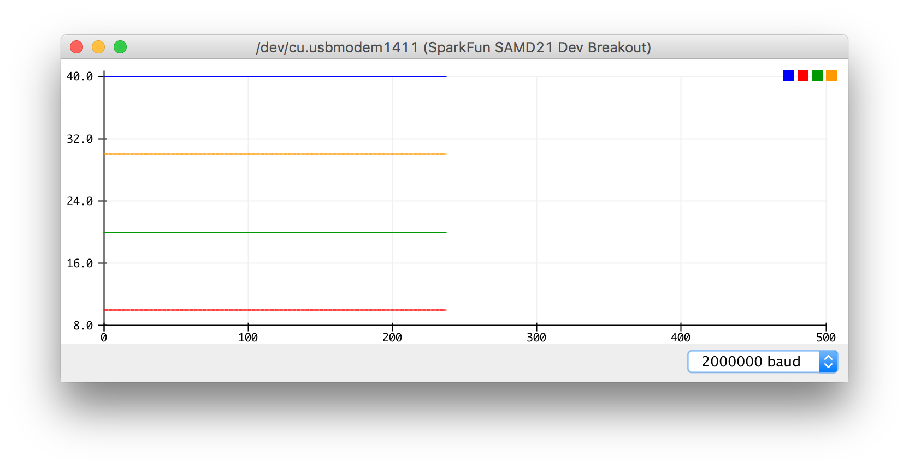
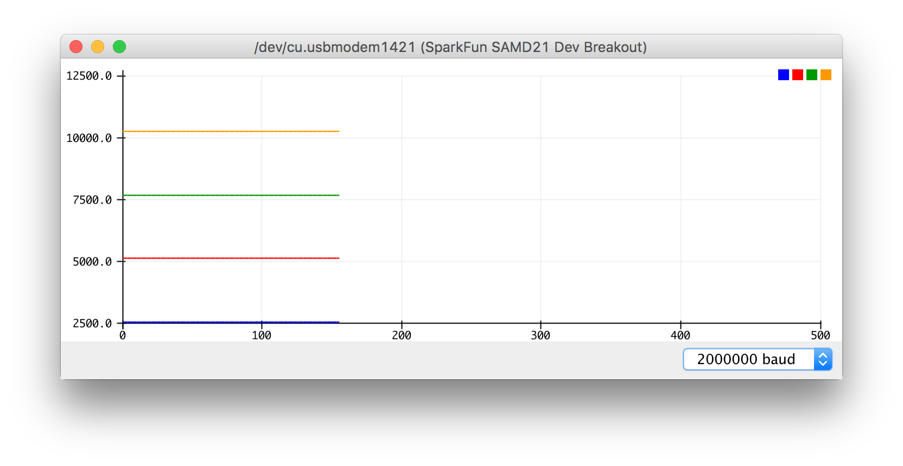
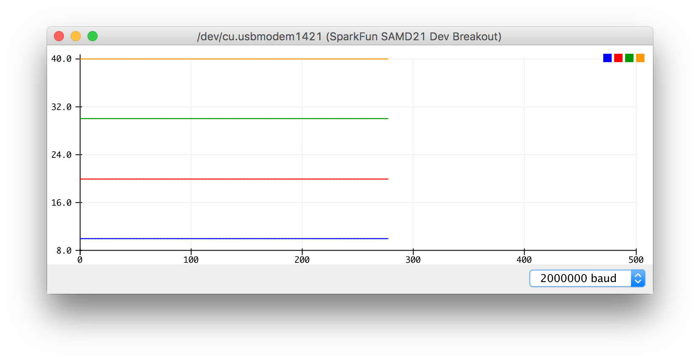
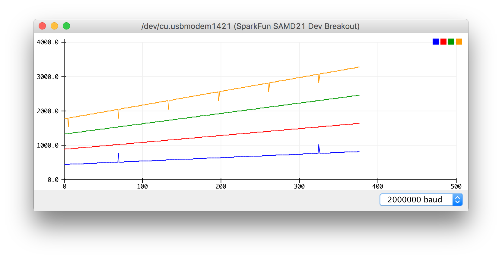
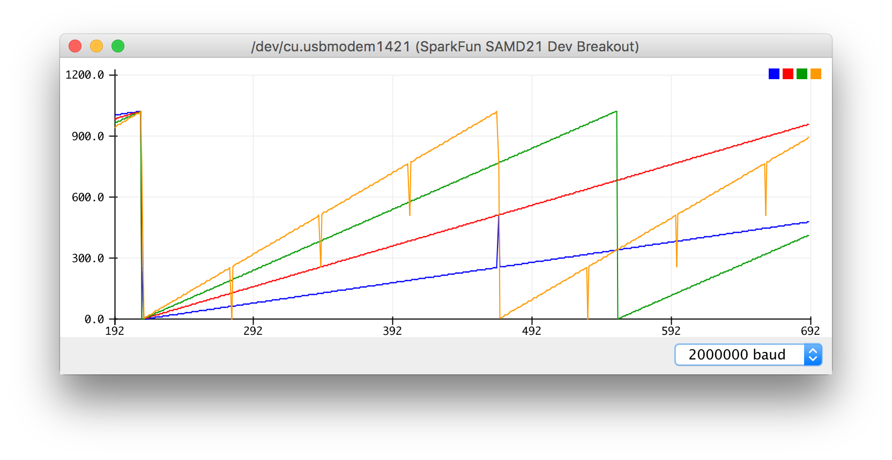
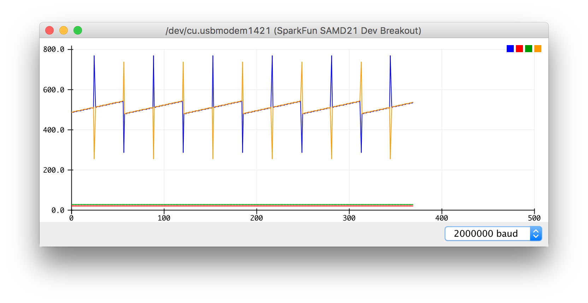
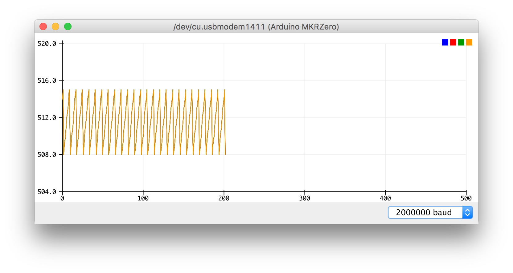
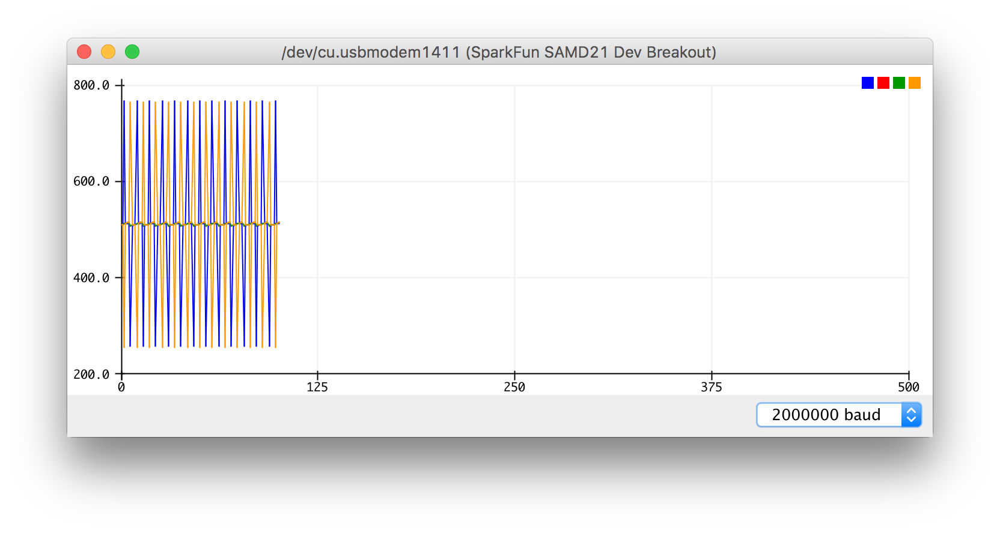

Series of arduino examples that emerged during my spare time project.
I would be very glad if someone knows the answer to the following questions.

# Questions

Why does [this setup](#after-bugfixing) require to skip 3 bytes during each SPI transaction?


# SPI

Within this section i am trying to figure out how to communicate over [SPI](https://en.wikipedia.org/wiki/Serial_Peripheral_Interface_Bus) using two different boards:
An [Arduino MKRZero](https://store.arduino.cc/arduino-mkrzero) and
  a [SparkFun SAMD21 Mini Breakout](https://github.com/sparkfun/SAMD21_Mini_Breakout).
I will reference these boards for simplicity, `mkrzero` and `samd21mini` respectively.
Regard this section as a collection of template programs for certain communication patterns.
This is also used to document certain problems as i progress implementing the project.
It is also a little comparison between both boards, but mainly focuses on the communication part.
But lets start with a small collection of references for both boards.

## Cheat Sheet

Both are using the same *Atmel [ATSAMD21G18](http://www.microchip.com/wwwproducts/en/ATSAMD21G18) µc*.
This facilitates porting programs between both boards.
However, board layouts and periphereals differ.
Best source for these information are the corresponding github repositories and manufacturer pages.
Thanks to the arduino platform both repositories have a similar structure.
Here are the most important files together with other technical references in comparison:

| `mkrzero` | `samd21mini` |
|-----------|--------------|
| [repo](https://github.com/arduino/ArduinoCore-samd/tree/master)                                        | [repo](https://github.com/sparkfun/Arduino_Boards/tree/master/sparkfun/samd) |
| [variants dir](https://github.com/arduino/ArduinoCore-samd/tree/master/variants/mkrzero)               | [variants dir](https://github.com/sparkfun/Arduino_Boards/tree/master/sparkfun/samd/variants/SparkFun_SAMD_Mini) |
| [variant.h](https://github.com/arduino/ArduinoCore-samd/blob/master/variants/mkrzero/variant.h)        | [variant.h](https://github.com/sparkfun/Arduino_Boards/blob/master/sparkfun/samd/variants/SparkFun_SAMD_Mini/variant.h) |
| [variant.cpp](https://github.com/arduino/ArduinoCore-samd/blob/master/variants/mkrzero/variant.cpp)    | [variant.cpp](https://github.com/sparkfun/Arduino_Boards/blob/master/sparkfun/samd/variants/SparkFun_SAMD_Mini/variant.cpp) |
| [manufacturer](https://store.arduino.cc/arduino-mkrzero)                                               | [manufacturer](https://github.com/sparkfun/SAMD21_Mini_Breakout) |
| [getting started](https://www.arduino.cc/en/Guide/ArduinoMKRZero)                                      | [getting started](https://learn.sparkfun.com/tutorials/samd21-minidev-breakout-hookup-guide/resources--going-further) |
| [schematic](https://www.arduino.cc/en/uploads/Main/ArduinoMKRZero-schematic.pdf)                       | [schematic](https://cdn.sparkfun.com/assets/learn_tutorials/4/5/4/sparkfun-atsamd21g-breakout-schematic.pdf) |
| [pcb backside](http://files.linuxgizmos.com/arduino_mkrzero_back.jpg) (nothing comparable)             | [graphical datasheet](https://cdn.sparkfun.com/assets/learn_tutorials/4/5/4/graphicalDatasheet-Mini.pdf) |


## Program's Origin

Programs that appear in slave configuration are based on one particular source.
User *Tom_the_banana* posted it [on the Arduino forum](https://forum.arduino.cc/index.php?topic=360026.0).
Thanks to this i was able to jump start with a simple slave configuration right away.
I appreciate his code very much :)
However i found some adaptions useful in general and others necessary to my underlying use case.


## Communication Patterns

These terms will make it easier to identify certain communication patterns.
At least during debugging when things are simplified for trouble shooting.


### Unidirectional Slave Send and Master Recieve

The code of *Tom_the_banana* can be classified as what i call a **slave reciever**.
That is, because it is a slave that is mainly designed to recieve data from its master.
Therefore, i turned the program into a **slave sender**.
Furthermore, there is a second program to form the **slave sender**'s counter part what i call a **master reciever**.
Note that these terms only apply to unidirectional communication patterns.
Well, or at least to those which have a clear focus to it.


### Bidirectional Loopback (TODO)

Within bidirectional communication patterns there is this notion of a **loopback** program.
Data that arrives is just send back to its sender.
This can be implemented on both; a master and a slave device.
That is useful for debugging certain problems as well and is going to be included later on.


### Forwarder (TODO)

TODO


## Wiring and Muxing
| wiring + supply | wiring only | master slave |
|-----------------|-------------|--------------|
|  |  |  |

Both boards are connected to a power supply. 
The `mkrzero` is fed with +5V over the `5V` pin and the `samd21mini` is fed with +3.3V over the `VCC` pin.
Furthermore, both are connected to ground over their corresponding `GND` pins.
Another connection leads to some pc using micro usb cables for programming and debugging.

Both boards are wired directly with each other over the SPI lines; `MISO`, `MOSI`, `SCK` and `SS`.
The `mkrzero` acts as the slave sender and the `samd21mini` as the master reciever.

| `samd21mini` _master reciever_ |  line     | `mkrzero` _slave sender_ |
|--------------------------------|-----------|--------------------------|
| `13`                           | `SCK`     | `A4`                     |
| `11`                           | `MOSI`    | `A3`                     |
| `12`                           | `MISO`    | `A6`                     |
| `10`                           | `SS`      | `A5`                     |

The hardware configuration on the `samd21mini` is already finished at this point within this use case.
That is, because the pins `10` to `13` correspond to the predefined default SPI instance.
Configuring the `mkrzero` is a little bit trickier.
The hardware configuration of the `mkrzero` within this use case is specified using the macros defined below.
This makes it easier to port this program to another board or different hardware configuration.
```
#define MY_SPI_MOSI    A3
#define MY_SPI_SCK     A4
#define MY_SPI_SS      A5
#define MY_SPI_MISO    A6
#define MY_SERCOM           SERCOM0
#define MY_SERCOM_IRQn      SERCOM0_IRQn
#define MY_SERCOM_HANDLER   SERCOM0_Handler
#define MY_GCM_SERCOM_CORE  GCM_SERCOM0_CORE
```

Since the analog lines `A3` to `A6` are not supposed to work as SERCOM lines by default, these need to be reprogrammed.
This reprogramming process is called muxing, which is a short term for multiplexing.
Usually pins are programmed with the `pinMode` function.
However, to overwrite predefined deafults use the `pinPeripheral` function which resides in `wiring_private.h`.
```
#include "wiring_private.h"
...
void setup() {
  ...
  pinPeripheral(MY_SPI_MISO,  PIO_SERCOM_ALT);
  pinPeripheral(MY_SPI_SCK,   PIO_SERCOM_ALT);
  pinPeripheral(MY_SPI_MOSI,  PIO_SERCOM_ALT);
  pinPeripheral(MY_SPI_SS,    PIO_SERCOM_ALT);
  ...
}
```
*Note:* These configurations must be chosen carefully and aren't arbitrary. 
The default hardware configuration of each board can be looked up within the corresponding `variants.h` and `variants.cpp` files.
For further reference consult the boards' and µc's datasheets.
These are all referenced within the [cheat sheet](#cheat-sheet).

For a closer look on muxing the ATSAMD21 in general, consult the excellent article and companion video presentation of _lady ada_ listed below. 
I recommend watching the video and follow the article along:
- [www.youtube.com](https://www.youtube.com/watch?v=L2edpBP3AWE)
- [learn.adafruit.com](https://learn.adafruit.com/using-atsamd21-sercom-to-add-more-spi-i2c-serial-ports/muxing-it-up)


## Programs

Lets have a look on the data structures which are goint to be shared in the slave sender and master reciever programs:
```
const int NWORDS = 4;
const int NBYTES = NWORDS * 2;

/// TYPE DEFINITIONS
typedef union { uint16_t words[NWORDS]; uint8_t bytes[NBYTES]; } MODEL;
void format(MODEL &model, char *msg) {
  sprintf(
    msg, "%d %d %d %d",
    model.words[0], model.words[1], model.words[2], model.words[3]
  );
}
```
Both programs always use 4 words, each consisting of 2 bytes, during SPI transactions.
The `typedef union {...} MODEL` allows to access either these 4 words or the underlying 8 bytes.
This `MODEL` allows to easily test and compare different transfer styles.


### Slave Send Program

There is an [implementation of this program](./mkrzero-slave-send/mkrzero-slave-send.ino) for the `mkrzero`.
The slave send program provides several options about what kind of data should be send to the master.
Available options are:

| expectation | callback | description |
|-------------|----------|-------------|
|           | `updateConst`      | constant bytes |
|         | `updateCounter`    | simple counters resulting in sawtooth shapes |
|  | `updateCounterMod` | simple counters with smaller mod to better focus on certain bits |
|       | `updateRangeBit9`  | ranged counters around the 9th bit that is good to illustrate a problem described below (not solved yet) |
|         | `updateComplex`    | complex datasets including sine wave shapes and real time counter |

Just use the global variable `doUpdate` to setup the desired callback function:
```
void (*doUpdate)(MODEL&) = updateComplex; // callback function pointer
```

This is going to update the `current` `MODEL` instance, as it is passed into the callback within the `loop` routine:
```
void loop() {
  if(!withinTx) last = current;
  if(preload && !withinTx) MY_SERCOM->SPI.DATA.reg = last.bytes[0];
  if(needsUpdate) {
    doUpdate(current);
    needsUpdate = false;
    format(current, msg);
    Serial.println(msg);
  }
}
```

Then reprogram the µC to produce the corresponding output as stated in the images above.
To reproduce the exact same output as above, use the plot viewer inside the Arduino IDE.

Use the global variable `preload` to switch between using preloading or not.
A value of `true` activates preloading as it is implemented right now.

### Master Recieve Program

There is an [implementation of this program](./SPI/samd21-master-revieve/samd21-master-revieve.ino) for the `samd21mini`.
The master recieve program provides several options.
One option controls how fast data should be gathered from the slave by specifying a `samplingDelay` in milliseconds.
The other option controls an `byteOffset` for the incoming bytes.
With this `byteOffset` it is possible to interpret the first incoming byte as the second byte or third byte and s.o..
These options are controlled through the code below.
```
int samplingDelay = 20;
int byteOffset = 1;
```

If everything works as expected the recieved data in the master corresponds exactly to the data being sent from the slave.


## Trouble Shooting

Only in rare cases everything works as expected on the first try.
Here is a summary of problems that emerged during the implementation.
Some of them have already been fixed, others are _worked around_ ;) and some are still unsolved yet.


### `updateConst`

```
void updateConst(MODEL &model) {
  model.words[0] = 10;
  model.words[1] = 20;
  model.words[2] = 30;
  model.words[3] = 40;
}
```

Let's start simple.
The `updateConst` should send 4x16 bits representing 4 constant values: `10`, `20`, `30`, `40`.

| expectation | result |
|-------------|--------|
|   |  |

The plot view is updated line by line and it renders the incoming data space separated.
The order determines the color mapping.
So it chooses blue for the first entry, red for the second and s.o..
Comparing the generated data with the recieved data reveals that the coloring and thus the ordering is wrong.

So, the master recieves 40 10 20 30 instead of 10 20 30 40.
To mitigate this, it is possible to play around with the `preload` on the slave and the `byteOffset` on the master.
First lets compare different offsets:

| `bytesOffset=0` | `bytesOffset=1` | `bytesOffset=2` |
|-----------------|-----------------|-----------------|
|  |  |  |

Since the each data value is 16 bits long an offset of 1 misalings the data.
An offset of 2 seems to enable the master to correctly interpret the data.
As the coloring indicates, blue comes first and is at value `10`.

Now examining the `preload` option in the slave sender reveals that it reduces the offset by 1.
So to reproduce the desired output, it is necessary to set the offset to 1 instead of 2.
For the moment, the preloading seems to work as expected.
But this does not explain why there was an offset of 2 bytes on the in the first place.
So this requires more investigation.


### `updateCounter`

```
void updateCounter(MODEL &model) {
  static uint16_t counter = 0;
  model.words[0] = counter * 1;
  model.words[1] = counter * 2;
  model.words[2] = counter * 3;
  model.words[3] = counter * 4;
  ++counter;
}
```

This produces 4 counter values which are updated each time being requested.
The first counter increments by 1, the second by 2, the third by 3 and the fourth by 4.

| expectation | result with `preload=true` & `byteOffset=1` |
|-------------|---------------------------------------------|
|   |  |

Huh, now these strange spikes appeared on first and last counter.
Switching `preload=false` and `byteOffset=2` removes the spikes.
This somewhat indicates that there might be an issue with the preloading as it is implemented.
Or maybe it is still the strange offset by 1 error discovered within [`updateConst`](#updateConst).

The pattern how the spikes appear is very interesting.
Maybe it is possible to nail the problem down, examining this in more detail.


### `updateCounterMod`

```
void updateCounterMod(MODEL &model) {
  static uint16_t counter = 0;
  uint16_t mod = 1 << 10;
  model.words[0] = counter * 1 % mod;
  model.words[1] = counter * 2 % mod;
  model.words[2] = counter * 3 % mod;
  model.words[3] = counter * 4 % mod;
  ++counter;
}
```

This produces the same 4 counter values as in [`updateCounter`](#updateCounter) but applies mod 512 after incrementing.
The domain of the counters are only using 9 of the 16 bits this way and produce sawtooth shapes with different frequencies.

| expectation | result with `preload=true` & `byteOffset=1` |
|-------------|---------------------------------------------|
|   |  |

Spikes are still apearing in this constellation.
Again, switching to `preload=false` and `byteOffset=2` removes the spikes.

However, now it is possible to track down the behaviour more precisely due to the restricted domain.
Here are some observations:
- The blue and yellow line correspond to the first and last data value.
- The spike at the blue line seems to appear at a value of 256 which is at around the 8th bit.
- The spike of the yellow line appears at a rate 4 times faster than the blue line.
- The blue spikes jump up, where the yellow spikes jump down.

There are still some thoughts about this jumping up and down behaviour.
I will going to investigate this jumps' directions with another setup later on.
So let's skip that for now.
Furthermore, let's also skip the frequency behaviour about the fourth counter being 4 times faster as well.
For now let's focus on the problem domain around the 8th bit of the first and last values.


### `updateRangeBit9`

```
void updateRangeBit9(MODEL &model) {
  static uint16_t counter = 0;
  uint16_t bit9 = 1 << 9;
  uint16_t range = 1 << 6;
  uint16_t offset = bit9 - range / 2;
  model.words[0] = offset + counter % range;
  model.words[1] = 20;
  model.words[2] = 30;
  model.words[3] = offset + counter % range;
  ++counter;
}
```

This reproduces the first and last of the 4 counter values as in [`updateCounterMod`](#updateCounterMod) but adds a number offset to them.
With this it is possible to focus on the spike parts.
The other 2 values at position 2 and 3 are just constant values 20 and 30.

| expectation | result with `preload=true` & `byteOffset=1` |
|-------------|---------------------------------------------|
|   |  |

Alternatively modify the code to use a range of just 3 bits instead of 6.
Furthermore, use the same counter value at all 4 positions:
```
void updateRangeBit9(MODEL &model) {
  static uint16_t counter = 0;
  uint16_t bit9 = 1 << 9;
  uint16_t range = 1 << 3;
  uint16_t offset = bit9 - range / 2;
  model.words[0] = offset + counter % range;
  model.words[1] = offset + counter % range;
  model.words[2] = offset + counter % range;
  model.words[3] = offset + counter % range;
  ++counter;
}
```

With this reduced range it is possible to inspect plot view again but now together with the serial monitor output:

| expectation | result with `preload=true` & `byteOffset=1` |
|-------------|---------------------------------------------|
|   |  |

```
508 508 508 508   508 509 509 509
509 509 509 509   509 510 510 510
510 510 510 510   510 511 511 511
511 511 511 511   767 512 512 256
512 512 512 512   512 513 513 513
513 513 513 513   513 514 514 514
514 514 514 514   514 515 515 515
515 515 515 515   259 508 508 764
508 508 508 508   508 509 509 509
```

Well that is interesting.
Seems like the first value is always belonging to the previous cycle after interpreting the incoming data.
Let's toggle the output format from decimal to hex on the master reciever.
With this change it should be possible to see exactly where the bits are flowing to:
```
void format(MODEL &model, char *msg) {
  sprintf(
    msg, "%d %d %d %d",  // <-- replaced 'd' with 'x'
    model.words[0], model.words[1], model.words[2], model.words[3]
  );
}
```

This produces the following output:
```
508 508 508 508   508 509 509 509   1fc 1fd 1fd 1fd
509 509 509 509   509 510 510 510   1fd 1fe 1fe 1fe
510 510 510 510   510 511 511 511   1fe 1ff 1ff 1ff
511 511 511 511   767 512 512 256   2ff 200 200 100
512 512 512 512   512 513 513 513   200 201 201 201
513 513 513 513   513 514 514 514   201 202 202 202
514 514 514 514   514 515 515 515   202 203 203 203
515 515 515 515   259 508 508 764   103 1fc 1fc 2fc
508 508 508 508   508 509 509 509   1fc 1fd 1fd 1fd
```
In line 511 it starts to get interesting which corresponds a hex value of 1ff.
The next value should be 512 with a corresponding hex value of 200.
However, it gets messed up and produces a 767 with a corresponding hex value of 2ff.

So the LSB of the first value belongs to the previous cycle but the MSB is correct.
In contrast to that the MSB of the last value seems to belong to the previous cycle but the LSB is correct.
Without the `byteOffset=1` it should be possible to see this even clearer:
```
508 508 508 508   508 509 509 509   1fc 1fd 1fd 1fd   fc01 fd01 fd01 fd01
509 509 509 509   509 510 510 510   1fd 1fe 1fe 1fe   fd01 fe01 fe01 fe01
510 510 510 510   510 511 511 511   1fe 1ff 1ff 1ff   fe01 ff01 ff01 ff01
511 511 511 511   767 512 512 256   2ff 200 200 100   ff01 0002 0002 0002
512 512 512 512   512 513 513 513   200 201 201 201   0002 0102 0102 0102
513 513 513 513   513 514 514 514   201 202 202 202   0102 0202 0202 0202
514 514 514 514   514 515 515 515   202 203 203 203   0202 0302 0302 0302
515 515 515 515   259 508 508 764   103 1fc 1fc 2fc   0302 fc01 fc01 fc01
508 508 508 508   508 509 509 509   1fc 1fd 1fd 1fd   fc01 fd01 fd01 fd01
```

Indeed! Only the first 16 bits are leaping one cycle behind.
This seems to be a bug in the update mechanic.
The preloaded data is older than the rest of the trasmitted data.
This looks like a data race between the ISR and the `loop` function on the slave sender. :facepalm:
So this problem can be fixed within the slave sender.
Nailed it!


### After Bugfixing

So the last enlightment made me rework the slave sender's code in order to avoid data races.
The new version uses some alternating buffer.
The idea is that if the main loop works on the first buffer the second buffer is safe to read from within the interrupt service routine.
And vice versa.

However, the result is not satisfactory, because the resulting program generates the same output.
The assumption is that i am not understanding the transfer section in the datasheet correctly.
Nonetheless, i have reduced complexity and don't take preloading into account for the moment.
There is an [implementation of this program](./mkrzero-slave-send-fixed/mkrzero-slave-send-fixed.ino) for the `mkrzero`

On the master reciever the code is modified as well.
It now has the option to physically skip a specified amount of bytes.
The `samplingDelay` is now using microseconds instead of milliseconds.
And the `format` method now can be fed with different formats.
There is an [implementation of this program](./samd21-master-revieve-skipping/samd21-master-revieve-skipping.ino) for the `samd21mini`
```
const char* AHEX_FMT = "%04x %04x %04x %04x";
const char* DEC_FMT  = "%d %d %d %d";
const char* FORMAT = DEC_FMT;

...

void loop() {
  digitalWrite(PIN_SPI_SS, LOW);
  SPI.beginTransaction(settings);

  for(int i=0; i<skippedBytes; i++)
    SPI.transfer(0xF);

  for(int i=0; i<NBYTES; i++) {
    delayMicroseconds(2); // play with this parameter
    int k = (i + NBYTES - byteOffset) % NBYTES;
    data.bytes[k] = SPI.transfer(data.bytes[k]);
  }
  delayMicroseconds(2); // play with this parameter
  SPI.endTransaction();
  digitalWrite(PIN_SPI_SS, HIGH);

  format(data, msg);
  SerialUSB.println(msg);

  delayMicroseconds(samplingDelay);
}
```

The following comparison reveals that 3 bytes need to be skipped in order to retrieve consistent data.
With my basic understanding i would expect there to be only 1 byte of junk when no preloading is being used:
```
skippedBytes=0       skippedBytes=1       skippedBytes=2       skippedBytes=3
01fc 01fd 01fd 01fd  fdfc fd01 fd01 fd01  fd0f fd01 fd01 fd01  01fd 01fd 01fd 01fd
01fd 01fe 01fe 01fe  fefd fe01 fe01 fe01  fe0f fe01 fe01 fe01  01fe 01fe 01fe 01fe
01fe 01ff 01ff 01ff  fffe ff01 ff01 ff01  ff0f ff01 ff01 ff01  01ff 01ff 01ff 01ff
01ff 0200 0200 0200  00ff 0002 0002 0002  000f 0002 0002 0002  0200 0200 0200 0200
0200 0201 0201 0201  0100 0102 0102 0102  010f 0102 0102 0102  0201 0201 0201 0201
0201 0202 0202 0202  0201 0202 0202 0202  020f 0202 0202 0202  0202 0202 0202 0202
0202 0203 0203 0203  0302 0302 0302 0302  030f 0302 0302 0302  0203 0203 0203 0203
0203 01fc 01fc 01fc  fc03 fc01 fc01 fc01  fc0f fc01 fc01 fc01  01fc 01fc 01fc 01fc
01fc 01fd 01fd 01fd  fdfc fd01 fd01 fd01  fd0f fd01 fd01 fd01  01fd 01fd 01fd 01fd
```

The data above is produced with a modified version of `updateRangeBit9`.
It was modified so that all 4 words had the same data within the transaction.
After turning back the code to its original state, the output was ordered as expected.
Therefore, no `byteOffset` is required anymore.
