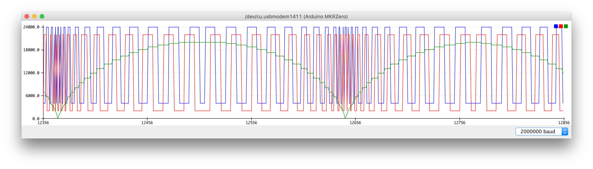
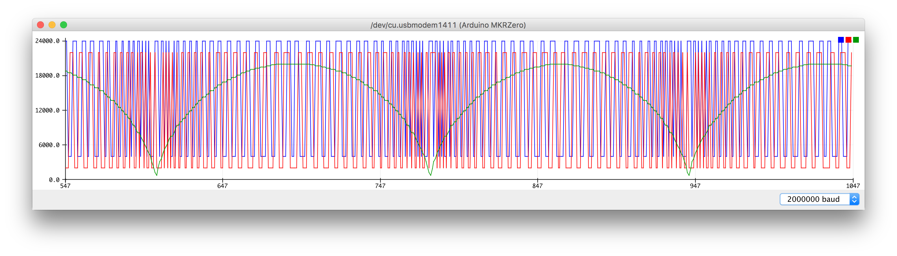
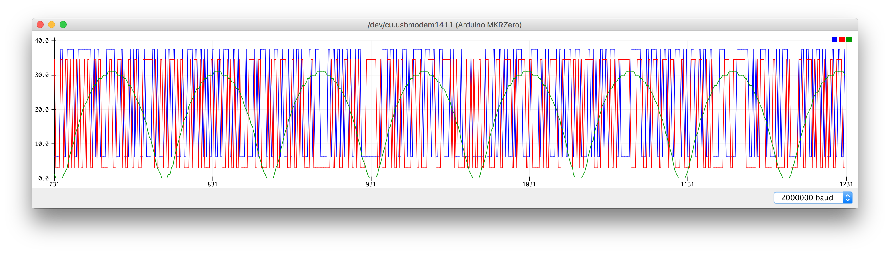
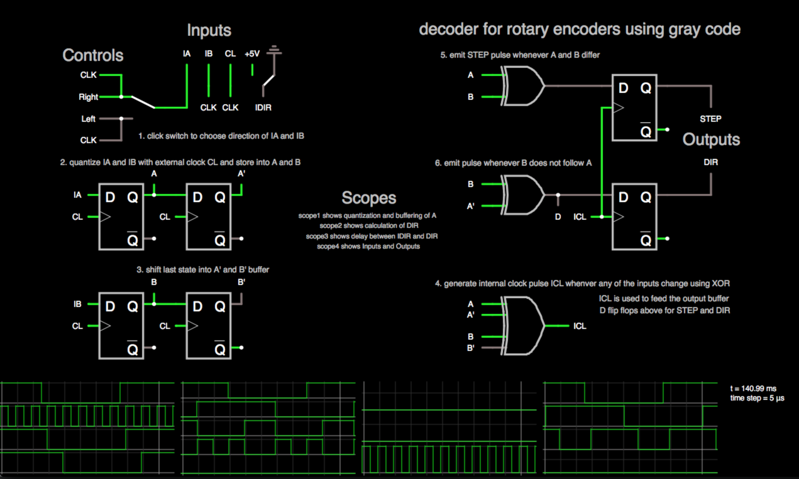
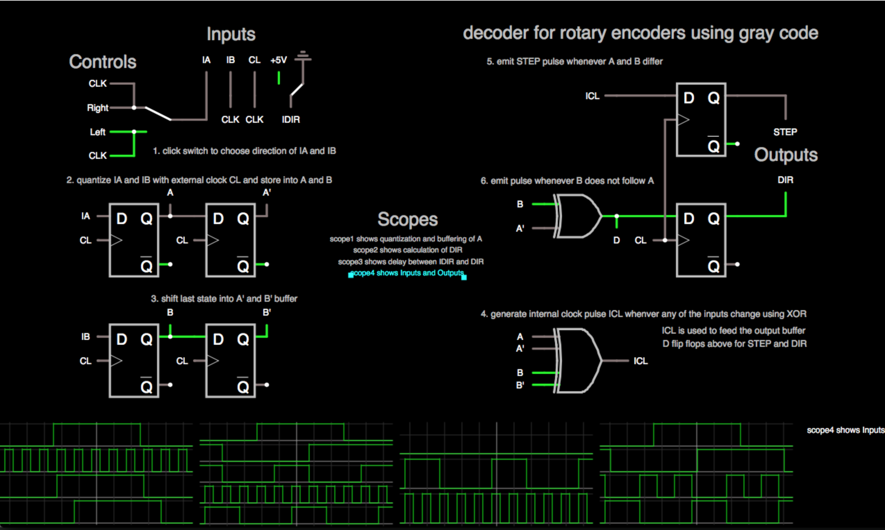

# Quad Decoders on Teensy 3.2

This is a small comparison of different solutions to decode a given quadrature input generated by some source of rotary encoded signals.
The short term for this type of decoder will be called qdec.
The short term for this type of signals will be called rotary signals.
The goal is to generate an absolute value for an ideal rotary signal source operating at high speeds.
Unfortunately, real world applications will not be ideal and contain mechanically driven errors, because every mechanical piece vibrates and bounces slightly.
However, mechanical error detection is not within scope of this comparison.


## Rotary signal source

First start with small program running running on a mkrzero that serves as parameterized source of rotary signals.
The program can be tweaked to benchmark a mechanically ideal scenario at different speeds.


### Heterogenous Source

The rotary signals beeing generated by this source simulate a piston that moves back and forth.
Therefore the movement speed is not constant, rather it decays and accellerates in a cyclic fashion.
The red and blue lines on the plot below show the generated signal lines a and b.
The green line on the plot shows the delay until the next state transition occurs.


[Goto Source](./samd21-cyclic-rotary-signal-emulator/samd21-cyclic-rotary-signal-emulator.ino)

Any qdec being connected to this source should be counting up until it turns, then it should be counting down until it turns again.
Turn points are where the green line reaches its maxium, thus where the speed is at its minimum.
When the qdec tracks the minimum and maximum of its internal counter values, then it is possible to detect if the qdec is operating correctly.
The range between the maximum and the minumum of the counter should always be constant, after one full cycle.
Whenever the system misses a count signal or erroneously counts twice a signal, then this should be reflected in the counter range.
The system under test is going to be excercised at different speeds in order to detect the maxium frequency.
This forms the comparison base.

Pin settings:
```c
const int  POSITION_ENC_A  = 6;
const int  POSITION_ENC_B  = 7;
```

| Speed      | medium | fast |
|------------|---------------------------------------------------------|-------------------------------------------------------|
| Image      |  |  |
| `stepFreq` | 10                                                      | 400 * 16                                              |
| `revs`     | 100                                                     | 1600                                                  |


### Homogenous Source

It is also possible to generate a source which has a constant speed and only moves into one direction.
To detect errors in such a scenario take the amount of count signals per second into account.
Thus the counts generated by the source against the counts detected by the qdec.


## Solutions

To decode a signal generated by a rotary encoder, there are several solutions at hand.
Let's start with a short classification of different kinds of input modes for the available solutions:

| Input Mode    | Performace | Possibilities           |
|---------------|------------|-------------------------|
| polling       | low        | Encoder library         |
| 2 interrupts  | medium     | Encoder library         |
| 1 interrupts  | high       | Dedicated hardware qdec |
| no interrupts | very high  | On-chip hardware qdec   |

As usual, any poll based system is goint to be outperformed by a system using interrupts when implemented correctly.
When using two interrupts, then the system is going to be busy handling those interrupts at high speeds.
To overcome this problem there are at least two possible solutions at hand, but both try to reduce the number of required interrupts:
Either reduce reduce the resolution and handle only half of the available rotary signal events.
Or try to aggregate both signal source lines into a single source line with dedicated hardware.
In this case the dedicated hardware approach is going to be preferred due to existing requirements.
The highest performance can be achieved with a special hardware decoder residing on the chip.
However, this requires deeper knowledge of the chip which i currently cannot afford.

- Encoder library
- Separate hardware qdec
- On-chip hardware qdec


## Encoder Library

The encoder library is easy to use and get started with.
It allows to be used with interrupts or without and can be tweaked in various dimensions.
Fortunately, this solution is well suited for manually driven inputs, requires a minimum amount of code and none of extra hardare.
However, it appeared to be not responsive enough for highly dynamic systems.


## Dedicated hardware qdec

The hardware is based on the [solution described here](https://www.mikrocontroller.net/articles/Drehgeber#Dekoder_mit_diskreten_Logik-ICs) with [this underlying schematic](https://www.mikrocontroller.net/wikifiles/3/3f/Schaltplan_quad_decoder.png) and should help to reduce the computational load on the controller.
There are two variants of this circuit being tested: Without internal and with internal clock.


### Without internal clock

The circuit takes the two rotary signal lines, `IN_A` and `IN_B` together with a measurement clock `CLK` as input.
Using that, it returns a `CLOCK_ENABLE` signal used to drive the interrupt at a controller and the `DIR` signal.
[Here](http://tinyurl.com/ycyt5yrc) is a simulation of that circuit that allows to switch between left and right movement direction by clicking on the switch.

However, this particular circuit doesn't keep track of the direction prvided by the `DIR` signal.
It just allows to see what the direction was during the last transition within a single clock cycle.
Unfortunately, the logic seems to be a little bit too confusing for me to replicate it or it is just buggy.
It seems that one needs to keep track of more than just one cycle, although the purpose of the hardware is to take out computational load out of the controller.


### With internal clock

It turns out that the circuit can be modified slightly to mitigate this shortcoming.
[Here](http://tinyurl.com/ybf5wwbd) is modified version of the circuit which directly outputs the direction and doesn't seem to have any issues.
Take a close look at the output section:

| Simulation   | [with internal clock](http://tinyurl.com/ybf5wwbd) | [without internal clock](http://tinyurl.com/ycyt5yrc) |
|--------------|----------------------------------------------------|-------------------------------------------------------|
| Image        |         |         |
| Output Clock | `ICL` serves as clock for the outputs              | `CL` serves as clock for the outputs                  |
| `STEP`       | `A ^ B` serves as source for the `STEP` output     | `ICL` serves as source for the `STEP` output          |
| File*        | [Simulation Code](./with-icl.circuitjs.txt)        | [Simulation Code](./without-icl.circuitjs.txt)        |

The modification takes the `ICL = A ^ A' ^ B ^ B'` signal as output clock for the output flip flops.
Furthermore, it uses the `A ^ B` signal as input for the `STEP` flip flop to produce the output.

&ast; In case the tinyurl links break in the future, here are the file exports for the simulations.

